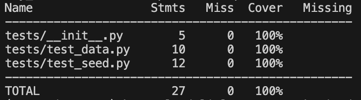
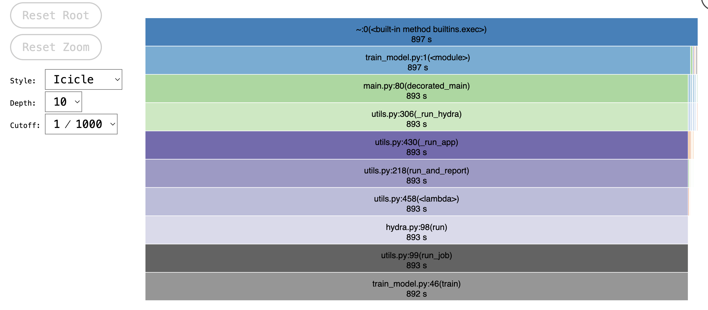
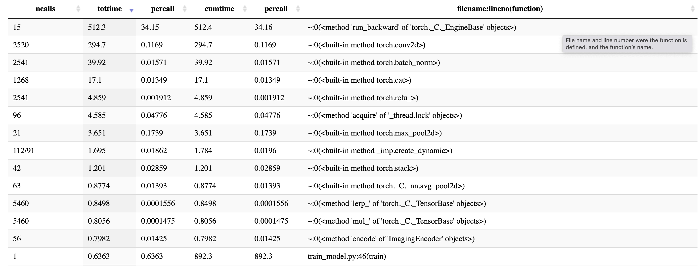

# Exam template for 02476 Machine Learning Operations

This is the report template for the exam. Please only remove the text formatted as with three dashes in front and behind
like:

```--- question 1 fill here ---```

where you instead should add your answers. Any other changes may have unwanted consequences when your report is auto
generated in the end of the course. For questions where you are asked to include images, start by adding the image to
the `figures` subfolder (please only use `.png`, `.jpg` or `.jpeg`) and then add the following code in your answer:

```markdown

```

In addition to this markdown file, we also provide the `report.py` script that provides two utility functions:

Running:

```bash
python report.py html
```

will generate an `.html` page of your report. After deadline for answering this template, we will autoscrape
everything in this `reports` folder and then use this utility to generate an `.html` page that will be your serve
as your final handin.

Running

```bash
python report.py check
```

will check your answers in this template against the constrains listed for each question e.g. is your answer too
short, too long, have you included an image when asked to.

For both functions to work it is important that you do not rename anything. The script have two dependencies that can
be installed with `pip install click markdown`.

## Overall project checklist

The checklist is *exhaustic* which means that it includes everything that you could possible do on the project in
relation the curricilum in this course. Therefore, we do not expect at all that you have checked of all boxes at the
end of the project.

### Week 1

* [x] Create a git repository
* [x] Make sure that all team members have write access to the github repository
* [x] Create a dedicated environment for you project to keep track of your packages
* [x] Create the initial file structure using cookiecutter
* [x] Fill out the `make_dataset.py` file such that it downloads whatever data you need and
* [x] Add a model file and a training script and get that running
* [x] Remember to fill out the `requirements.txt` file with whatever dependencies that you are using
* [x] Remember to comply with good coding practices (`pep8`) while doing the project
* [x] Do a bit of code typing and remember to document essential parts of your code
* [x] Setup version control for your data or part of your data
* [x] Construct one or multiple docker files for your code
* [x] Build the docker files locally and make sure they work as intended
* [x] Write one or multiple configurations files for your experiments
* [x] Used Hydra to load the configurations and manage your hyperparameters
* [ ] When you have something that works somewhat, remember at some point to to some profiling and see if
      you can optimize your code
* [x] Use Weights & Biases to log training progress and other important metrics/artifacts in your code. Additionally,
      consider running a hyperparameter optimization sweep.
* [ ] Use Pytorch-lightning (if applicable) to reduce the amount of boilerplate in your code

### Week 2

* [x] Write unit tests related to the data part of your code
* [x] Write unit tests related to model construction and or model training
* [x] Calculate the coverage.
* [x] Get some continuous integration running on the github repository
* [x] Create a data storage in GCP Bucket for you data and preferable link this with your data version control setup
* [x] Create a trigger workflow for automatically building your docker images
* [x] Get your model training in GCP using either the Engine or Vertex AI
* [x] Create a FastAPI application that can do inference using your model
* [ ] If applicable, consider deploying the model locally using torchserve
* [ ] Deploy your model in GCP using either Functions or Run as the backend

### Week 3

* [ ] Check how robust your model is towards data drifting
* [ ] Setup monitoring for the system telemetry of your deployed model
* [ ] Setup monitoring for the performance of your deployed model
* [ ] If applicable, play around with distributed data loading
* [ ] If applicable, play around with distributed model training
* [ ] Play around with quantization, compilation and pruning for you trained models to increase inference speed

### Additional

* [ ] Revisit your initial project description. Did the project turn out as you wanted?
* [x] Make sure all group members have a understanding about all parts of the project
* [ ] Uploaded all your code to github

## Group information

### Question 1
> **Enter the group number you signed up on <learn.inside.dtu.dk>**
>
> Answer:

Group 32

### Question 2
> **Enter the study number for each member in the group**
>
> Example:
>
> *sXXXXXX, sXXXXXX, sXXXXXX*
>
> Answer:

s222522, s222700, s222577

### Question 3
> **What framework did you choose to work with and did it help you complete the project?**
>
> Answer length: 100-200 words.
>
> Example:
> *We used the third-party framework ... in our project. We used functionality ... and functionality ... from the*
> *package to do ... and ... in our project*.
>
> Answer:

For our project, we worked with the MONAI framework (https://github.com/Project-MONAI/tutorials/blob/main/2d_classification/monai_101.ipynb). It is a freely available collaborative framework built for accelerating research and clinical collaboration in Medical Imaging. We haven’t used MONAI for dataset download nor data pre-processing. Instead, we used it to define a Densenet model architecture and to run the training. The functionality was imported like this: from monai.networks.nets import densenet121. This saved us a lot of time because we didn’t have to build up the Neural Network by ourselves. So, the model was created with only one line of code. Furthermore, the model implementation is coordinated with the training and thus prevents errors.

## Coding environment

> In the following section we are interested in learning more about you local development environment.

### Question 4

> **Explain how you managed dependencies in your project? Explain the process a new team member would have to go**
> **through to get an exact copy of your environment.**
>
> Answer length: 100-200 words
>
> Example:
> *We used ... for managing our dependencies. The list of dependencies was auto-generated using ... . To get a*
> *complete copy of our development environment, one would have to run the following commands*
>
> Answer:

We managed dependencies in our project using a Makefile. The Makefile defined various commands to create and manage the project environment. To set up the environment, a team member would run make create_environment, which utilized Conda to create a virtual environment with the specified Python version (3.11 in this case). The dependencies were listed in the requirements.txt file, and running make requirements installed all the necessary Python packages. To replicate our environment, a new team member would need to clone the project repository, create the environment, and install dependencies by running the specified Makefile commands. The provided Makefile ensures a streamlined process for setting up and managing the project environment.

### Question 5

> **We expect that you initialized your project using the cookiecutter template. Explain the overall structure of your**
> **code. Did you fill out every folder or only a subset?**
>
> Answer length: 100-200 words
>
> Example:
> *From the cookiecutter template we have filled out the ... , ... and ... folder. We have removed the ... folder*
> *because we did not use any ... in our project. We have added an ... folder that contains ... for running our*
> *experiments.*
> Answer:

From the Cookiecutter template, we have filled out MAKEFILE, README.md, data, models, pyproject.toml, reports, requirements.txt, tests, as well as the source code for the project. Additionally, we inserted a folder called fastapi, to run the deployment. Furthermore, a folder with the docker files was added. The docker file was used to build a virtual machine that runs the training later on in the cloud. Furthermore, we included dvc for data handling and git for code handling. Therefore the folders .dvc and .github were included as well. On top of that also the output of the trained models for wandb was included. We didn't use for instance the notebooks folder because we didn't use any notebooks.

### Question 6

> **Did you implement any rules for code quality and format? Additionally, explain with your own words why these**
> **concepts matters in larger projects.**
>
> Answer length: 50-100 words.
>
> Answer:

We have added ruff's pre-commit hook to our .pre-commit-config.yaml file, this prevents the commit until the issues are resolved.

Besides that, we took care of good coding practices and documenting the steps. Furthermore, throught the cookiecutter template we organised our general code in a structured way. It is benefical to have uniform formatting because it makes collaboration more efficient, simplifies code reviews, and reduces errors. In larger projects, adhering to these standards becomes crucial for a cohesive and scalable codebase. Consistent coding practices are really important to efficiently collaborate among team members. Otherwise reviewing and understanding the code of other people becomes an even bigger challenge.

## Version control

> In the following section we are interested in how version control was used in your project during development to
> corporate and increase the quality of your code.

### Question 7

> **How many tests did you implement and what are they testing in your code?**
>
> Answer length: 50-100 words.
>
> Example:
> *In total we have implemented X tests. Primarily we are testing ... and ... as these the most critical parts of our*
> *application but also ... .*
>
> Answer:

In total we have implemented 2 tests. Primarly, we are testing the training data dimensions and the randomness of our experiments as these are the most critical parts of our project. With `test_data.py` we guarantee that the data splits correctly and with `test_seed.py` we examine every configuration file in order to check that the manual seed is always set to 42. This is a key aspect in our project, since we are randomnly altering image labels, we want to make sure that the experiments are reproducible and these images are the same when we train the model several times.


### Question 8

> **What is the total code coverage (in percentage) of your code? If you code had an code coverage of 100% (or close**
> **to), would you still trust it to be error free? Explain you reasoning.**
>
> Answer length: 100-200 words.
>
> Example:
> *The total code coverage of code is X%, which includes all our source code. We are far from 100% coverage of our **
> *code and even if we were then...*
>
> Answer:

The total code coverage is 100%, although this does not a guarantee that our code is error free. Coverage is just a measure of how many lines of code are run when your tests are executed. We only implemented two tests, therefore, there may still be some corner case that is not covered by our tests and will result in a bug. Although, the coverage is currently perfect, tests should cover a more diverse range of scenarios.



### Question 9

> **Did you workflow include using branches and pull requests? If yes, explain how. If not, explain how branches and**
> **pull request can help improve version control.**
>
> Answer length: 100-200 words.
>
> Example:
> *We made use of both branches and PRs in our project. In our group, each member had an branch that they worked on in*
> *addition to the main branch. To merge code we ...*
>
> Answer:

Branches and pull requests have played a pivotal role in improving the overall development and collaboration process of the project.

The default branch in our project was `master`. Besides, each one of us created branches to work on specific features : `unitesting`, `train`, `dvcintegration`... each branch represents a separate line of development, allowing us to separate our changes from the main codebase. Then, when each collaborator completed their work in a branch, we iniate a pull request to propose merging the changes into the main branch.

This system was usefull to work on simultaneously without interferring to others tasks. Also helped in resolving conflicts during the merging process back into the main branch.


### Question 10

> **Did you use DVC for managing data in your project? If yes, then how did it improve your project to have version**
> **control of your data. If no, explain a case where it would be beneficial to have version control of your data.**
>
> Answer length: 100-200 words.
>
> Example:
> *We did make use of DVC in the following way: ... . In the end it helped us in ... for controlling ... part of our*
> *pipeline*
>
> Answer:

We did make use of DVC in the following way: The folder data was ignored by gits version control. Instead, it was linked to dvc. Our central storage place is the bucket in google cloud. All the raw images and processed data is stored there. Therefore, the data didn't have to be uploaded to git. If a new team member would have entered the project, after cloning the project, the person simply has to run dvc pull to get all the necessary data for running the training. A big benefit is also that dvc can controlls which data was used to train the model at a specific time. Also using dvc, the results by running the training in the cloud can be easily stored in the google bucket.

### Question 11

> **Discuss you continues integration setup. What kind of CI are you running (unittesting, linting, etc.)? Do you test**
> **multiple operating systems, python version etc. Do you make use of caching? Feel free to insert a link to one of**
> **your github actions workflow.**
>
> Answer length: 200-300 words.
>
> Example:
> *We have organized our CI into 3 separate files: one for doing ..., one for running ... testing and one for running*
> *... . In particular for our ..., we used ... .An example of a triggered workflow can be seen here: <weblink>*
>
> Answer:

Our continuous integration (CI) workflow involves the following key components:
1.	Unittesting with Pytest: We run unittests using Pytest for two critical aspects, test_data and test_seed. These tests validae the dimensions of our datasets and ensure the reproducibility of our experiments by confirming the consistency of the manual seed.
2.	Coverage Measurement: this provides insights into the proportion of code executed during testing, helping us identify what lines need to be debugged.
3.	GitHub Actions Workflow: We have set up GitHub Actions workflow files within our repository to automate the testing process. This workflow ensures that tests are executed every time we push changes, maintaining a continuously validated code.
We did no find neceesary to write branch protection rules to our repository, since we are only three collaborators and we have been in continuous contact with each other, this way the workflow was more agile and flexible to us.
4.    Pre-Commit Hooks: we use pre-commit hooks to follow code standards and perform checks before each commit. These include hooks for handling trailing whitespace, fixing end-of-file issues, checking YAML syntax, and monitoring large file additions. Additionally, we added pre-commit hooks from the Ruff framework for formatting. We didn't use it pre-commit everytime, when it was necessary we deactivated it with `git commit -m <message> --no-verify`.


## Running code and tracking experiments

> In the following section we are interested in learning more about the experimental setup for running your code and
> especially the reproducibility of your experiments.

### Question 12

> **How did you configure experiments? Did you make use of config files? Explain with coding examples of how you would**
> **run a experiment.**
>
> Answer length: 50-100 words.
>
> Example:
> *We used a simple argparser, that worked in the following way: python my_script.py --lr 1e-3 --batch_size 25*
>
> Answer:

We configured experiments using hydra. Hydra was using different .yaml files, stored in the config/experiment folder. In these yaml files the necessary hyperparameters were stored, for instance the number of epochs or the learning rate. In our experiments, we examined the effect of wrong-labeled images during training on the resulting quality of the output. Therefore, we had different yaml files with different percentages of corrupted labels.

### Question 13

> **Reproducibility of experiments are important. Related to the last question, how did you secure that no information**
> **is lost when running experiments and that your experiments are reproducible?**
>
> Answer length: 100-200 words.
>
> Example:
> *We made use of config files. Whenever an experiment is run the following happens: ... . To reproduce an experiment*
> *one would have to do ...*
>
> Answer:

As stated in the previous question, we made use of configuration files. In every configurations file, the parameters for each experiment are setup. There is one file called `baseline.yaml` which was used to create the baseline experiment in which no label is corrupted. Therefore, the other files namely `exp10`, `exp20`, `exp30`, correspond to experiments with 10%, 20%, and 30% label corruption, respectively.

To ensure consistent results across runs, we set the seed to 42. Furthermore, our unittest, test_seed, validates that the seed is consistently set to 42 and not any other value.

To execute a specific experiment configuration, and replicate the experiment on would have to do: `python train_model.py experiment=exp20` (to change 20% of the image labels).

### Question 14

> **Upload 1 to 3 screenshots that show the experiments that you have done in W&B (or another experiment tracking**
> **service of your choice). This may include loss graphs, logged images, hyperparameter sweeps etc. You can take**
> **inspiration from [this figure](figures/wandb.png). Explain what metrics you are tracking and why they are**
> **important.**
>
> Answer length: 200-300 words + 1 to 3 screenshots.
>
> Example:
> *As seen in the first image when have tracked ... and ... which both inform us about ... in our experiments.*
> *As seen in the second image we are also tracking ... and ...*
>
> Answer:

--- question 14 fill here ---

### Question 15

> **Docker is an important tool for creating containerized applications. Explain how you used docker in your**
> **experiments? Include how you would run your docker images and include a link to one of your docker files.**
>
> Answer length: 100-200 words.
>
> Example:
> *For our project we developed several images: one for training, inference and deployment. For example to run the*
> *training docker image: `docker run trainer:latest lr=1e-3 batch_size=64`. Link to docker file: <weblink>*
>
> Answer:

--- question 15 fill here ---

### Question 16

> **When running into bugs while trying to run your experiments, how did you perform debugging? Additionally, did you**
> **try to profile your code or do you think it is already perfect?**
>
> Answer length: 100-200 words.
>
> Example:
> *Debugging method was dependent on group member. Some just used ... and others used ... . We did a single profiling*
> *run of our main code at some point that showed ...*
>
> Answer:

We tried using the build in debugger in VScode. However, since our code was not so extensive, all the membeers decided to just run the code and manually adressing errors when encountered.

We performed profiling several times. We used snakeviz to visualize the results. Here are two screenshots of profiling output of an experiment with the baseline configuration, with just 5 epochs:





We can see that the function that took the longest to run was the backward pass. It took a total of 512.3 sec and it was called 15 times, therefore it took 34.15 per pass.

## Working in the cloud

> In the following section we would like to know more about your experience when developing in the cloud.

### Question 17

> **List all the GCP services that you made use of in your project and shortly explain what each service does?**
>
> Answer length: 50-200 words.
>
> Example:
> *We used the following two services: Engine and Bucket. Engine is used for... and Bucket is used for...*
>
> Answer:

We used the following two services: Bucket and Engine. Bucket is used to store our data that was used to train the model. Furthermore, we can also store the output/results of the training in the bucket. Additionally, we used the Engine to store our VM instances. In this instance we loaded the docker image to get a containerised application where we performed the training.

### Question 18

> **The backbone of GCP is the Compute engine. Explained how you made use of this service and what type of VMs**
> **you used?**
>
> Answer length: 100-200 words.
>
> Example:
> *We used the compute engine to run our ... . We used instances with the following hardware: ... and we started the*
> *using a custom container: ...*
>
> Answer:

We used the compute engine to run our training in the cloud. We used a instance with the following hardware: The machine type was e2-custom-8-16896, without a GPU. Furthermore, we used a boot disk with 50 GB. We used the service to train our model. First we created a docker image based on the dockerfile in git. FOllowing, we created a VM with a container image with the latest version of the image. The images are stored in the container registry. The docker image was pulled into the VM and finally executed. We also installed git in the image, to update our code on an ongoing base.

### Question 19

> **Insert 1-2 images of your GCP bucket, such that we can see what data you have stored in it.**
> **You can take inspiration from [this figure](figures/bucket.png).**
>
> Answer:

[bucket](figures/bucket_project.png)

### Question 20

> **Upload one image of your GCP container registry, such that we can see the different images that you have stored.**
> **You can take inspiration from [this figure](figures/registry.png).**
>
> Answer:

[Container registry](figures/Container_registry_project.png).

### Question 21

> **Upload one image of your GCP cloud build history, so we can see the history of the images that have been build in**
> **your project. You can take inspiration from [this figure](figures/build.png).**
>
> Answer:

[Cloud build](figures/cloud_build_project.png)

### Question 22

> **Did you manage to deploy your model, either in locally or cloud? If not, describe why. If yes, describe how and**
> **preferably how you invoke your deployed service?**
>
> Answer length: 100-200 words.
>
> Example:
> *For deployment we wrapped our model into application using ... . We first tried locally serving the model, which*
> *worked. Afterwards we deployed it in the cloud, using ... . To invoke the service an user would call*
> *`curl -X POST -F "file=@file.json"<weburl>`*
>
> Answer:

--- question 22 fill here ---

### Question 23

> **Did you manage to implement monitoring of your deployed model? If yes, explain how it works. If not, explain how**
> **monitoring would help the longevity of your application.**
>
> Answer length: 100-200 words.
>
> Example:
> *We did not manage to implement monitoring. We would like to have monitoring implemented such that over time we could*
> *measure ... and ... that would inform us about this ... behaviour of our application.*
>
> Answer:

--- question 23 fill here ---

### Question 24

> **How many credits did you end up using during the project and what service was most expensive?**
>
> Answer length: 25-100 words.
>
> Example:
> *Group member 1 used ..., Group member 2 used ..., in total ... credits was spend during development. The service*
> *costing the most was ... due to ...*
>
> Answer:

Mainly one group member was responsible for the cloud setup so the majority of the costs are assigned to him. Somehow we spend a lot money on cloud storage, which were by far the highest costs
with around 30€. The compute engine were only a couple of euros. The Networking was the lowest with less then an Euro.

## Overall discussion of project

> In the following section we would like you to think about the general structure of your project.

### Question 25

> **Include a figure that describes the overall architecture of your system and what services that you make use of.**
> **You can take inspiration from [this figure](figures/overview.png). Additionally in your own words, explain the**
> **overall steps in figure.**
>
> Answer length: 200-400 words
>
> Example:
>
> *The starting point of the diagram is our local setup, where we integrated ... and ... and ... into our code.*
> *Whenever we commit code and puch to github, it auto triggers ... and ... . From there the diagram shows ...*
>
> Answer:


The starting point of the diagram is our local setup, where we setup our code, which is version controlle by github. We integrated the third party package into the code to train our model. Once, this was working we included hydra for setting the hyperparameters, as well as setting up our experiment using yaml files. We also included weights and biases to efficiently track our training results. Once this was working, we created a dockercontainer and make it run in the container as well. This docker image was used to setup the virtual machine in the cloud. Thereby the image in the cloud was updated using a trigger flow. Nevertheless, we installed github in the docker to pull our progress in an ongoing basis. Therefore, we didn't have to use every single generated image. The code was tracked with github while the data tracking was outsourced to dvc. The central storage place of our data is the google bucket. Furthermore, some unit tests were created to make sure that the code is working after we commit new lines of code. This was done in github by setting up workflows. These workflows were triggered every time we commit something. In other words, we set up some continuous integration. We deployed the model using FastAPI.

### Question 26

> **Discuss the overall struggles of the project. Where did you spend most time and what did you do to overcome these**
> **challenges?**
>
> Answer length: 200-400 words.
>
> Example:
> *The biggest challenges in the project was using ... tool to do ... . The reason for this was ...*
>
> Answer:

--- question 26 fill here ---

### Question 27

> **State the individual contributions of each team member. This is required information from DTU, because we need to**
> **make sure all members contributed actively to the project**
>
> Answer length: 50-200 words.
>
> Example:
> *Student sXXXXXX was in charge of developing of setting up the initial cookie cutter project and developing of the*
> *docker containers for training our applications.*
> *Student sXXXXXX was in charge of training our models in the cloud and deploying them afterwards.*
> *All members contributed to code by...*
>
> Answer:

--- question 27 fill here ---
